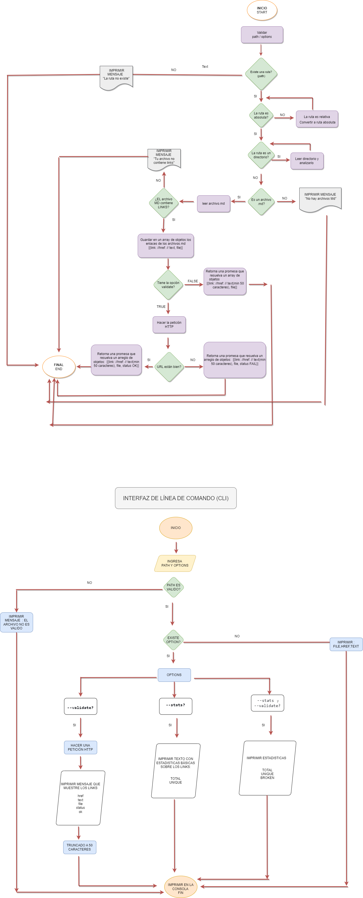

<p align="center" width="100%"> </p><br>

## Indice

* [1. Sobre el proyecto](#1)
* [2. Instalación](#2)
* [3. Uso](#3)
* [4. Objetivos de aprendizaje](#4)
* [5. Diagramas de flujo](#5)
* [6. Partes del proyecto](#6)
* [7. Referencias](#7)

***
## 1. Sobre el Proyecto
 <br/>

MD-Links es una herramienta de línea de comandos (CLI) que te permite analizar archivos Markdown (.md) y extraer los enlaces que se encuentran en ellos. Puedes obtener información sobre los enlaces, como la URL, el texto y el archivo donde se encuentran. Además, tienes la opción de validar el estado de los enlaces y obtener estadísticas sobre ellos.
 <br/>
 <br/>
 
 ## 2. Instalación
 <br/>

Para instalar el paquete, use el siguiente comando:
 <br/>

``` npm install katherinez-md-links ```
 <br/>
 <br/>

 ## 3. Uso
 <br/>

El paquete ofrece la siguiente interfaz:
 <br/>
 <br/>

``` md-links <path> [options] ```

 <br/>

Donde ```<ruta> ``` es la ruta absoluta o relativa al archivo a analizar, y ``` [opciones] ``` son ​​opciones adicionales que se pueden usar para personalizar la salida.
 <br/>
 <br/>
 ### Options:
 

```--Validate```
 <br/>
 
<p>Si se incluye esta opción, el paquete realizará una <b>solicitud HTTP</b> para verificar si cada enlace <b>funciona correctamente</b>. Si el enlace redirige a una URL que responde <b>"ok"</b>, se considerará como un enlace válido. El resultado incluirá el estado de la respuesta HTTP recibida.</p>
 <br/>

 ```--Estadísticas```
 <br/>
<p>Si se incluye esta opción, la salida incluirá <b>estadísticas básicas</b> sobre los enlaces encontrados en el archivo. Se mostrará el número total de enlaces encontrados y el número de enlaces únicos.</p>
 <br/>

 ```--Validate --tats```
 <br/>
 
<p>Si se incluyen <b>ambas opciones</b>, el resultado incluirá estadísticas sobre los enlaces encontrados, incluido cuántos enlaces están rotos (es decir, no responda "ok" al realizar una solicitud HTTP).</ p>

 <br/>

 ## 4. Objetivos de aprendizaje
### JavaScript

-  **Diferenciar entre tipos de datos primitivos y no primitivos**
- **Arrays (arreglos)**
-  **Objetos (key, value)**
-  **Uso de condicionales (if-else, switch, operador ternario, lógica booleana)**
-  **Funciones (params, args, return)**
-  **Recursión o recursividad**
-  **Módulos de CommonJS**
-  **Diferenciar entre expresiones (expressions) y sentencias (statements)**
-  **Callbacks**
-  **Promesas**
-  **Pruebas unitarias (unit tests)**
-  **Pruebas asíncronas**
-  **Uso de mocks y espías**
-  **Pruebas de compatibilidad en múltiples entornos de ejecución**
-  **Uso de linter (ESLINT)**
-  **Uso de identificadores descriptivos (Nomenclatura y Semántica)**
### Node.js

- **Instalar y usar módulos con npm**
-  **Configuración de package.json**
-  **Configuración de npm-scripts**
-  **process (env, argv, stdin-stdout-stderr, exit-code)**
-  **File system (fs, path)**
### Control de Versiones (Git y GitHub)

-  **Git: Instalación y configuración**
-  **Git: Control de versiones con git (init, clone, add, commit, status, push, pull, remote)**
-  **Git: Integración de cambios entre ramas (branch, checkout, fetch, merge, reset, rebase, tag)**
-  **GitHub: Creación de cuenta y repos, configuración de llaves SSH**
-  **GitHub: Colaboración en Github (branches | forks | pull requests | code review | tags)**
-  **GitHub: Organización en Github (projects | issues | labels | milestones | releases)**
### HTTP

-  **Consulta o petición (request) y respuesta (response).**
-  **Códigos de status de HTTP**

## 5. Diagramas de flujo
Para este proyecto realicé dos diagramas de flujo donde se muestra el flujo de API y CLI:

<p align="center" width="100%"> </p><br> 

## 6. Partes del proyecto
  **JavaScript API**

 Valor de retorno con validate : false 
 * `href`: URL encontrada.
* `text`: Texto que aparecía dentro del link (`<a>`).
* `file`: Ruta del archivo donde se encontró el link.

Valor de retorno con validate : true 
* `href`: URL encontrada.
* `text`: Texto que aparecía dentro del link (`<a>`).
* `file`: Ruta del archivo donde se encontró el link.
* `status`: Código de respuesta HTTP.
* `ok`: Mensaje `fail` en caso de fallo u `ok` en caso de éxito.

**CLI (Command Line Interface - Interfaz de Línea de Comando)**

El ejecutable de nuestra aplicación debe poder ejecutarse de la siguiente
manera a través de la **terminal**:

Comando principal:
#### `md-links`


#### Options
<br/>

##### `--validate`

Si pasamos la opción `--validate`, el módulo debe hacer una petición HTTP para
averiguar si el link funciona o no. Si el link resulta en una redirección a una
URL que responde ok, entonces consideraremos el link como ok.

Por ejemplo:
<p align="center" width="100%"> </p><br> 

##### `--stats`

Si pasamos la opción `--stats` el output (salida) será un texto con estadísticas
básicas sobre los links.

Por ejemplo:
<p align="center" width="100%"> </p><br> 

También podemos combinar `--stats` y `--validate` para obtener estadísticas que
necesiten de los resultados de la validación.

Por ejemplo:
<p align="center" width="100%"> </p><br>

##### `--help`

Adicional a estas opciones ya mencionadas, también se encuentra la opción que describe las instrucciones de uso de md-links y proporciona información sobre cómo ejecutarlo correctamente.

Por ejemplo:
<p align="center" width="100%"> </p><br>

## 7. Referencias


- [Node - Docs](https://nodejs.org/es/docs)
- [npm](https://www.npmjs.com/)
- [Jest - Getting Started](https://jestjs.io/docs/getting-started)
- [StackOverflow](https://stackoverflow.com/)
- [MDN WebDocs](https://developer.mozilla.org/en-US/)

 <br/>


